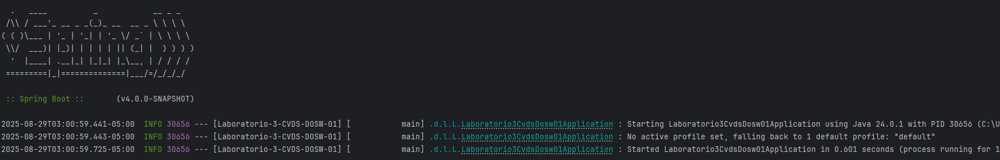
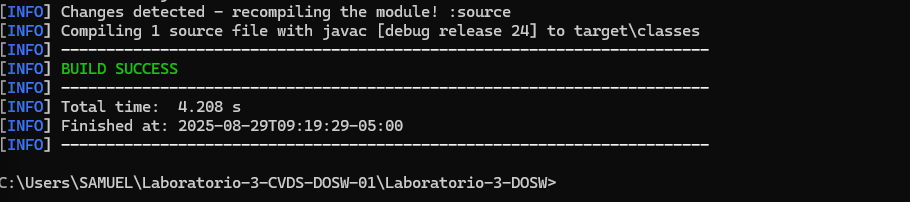
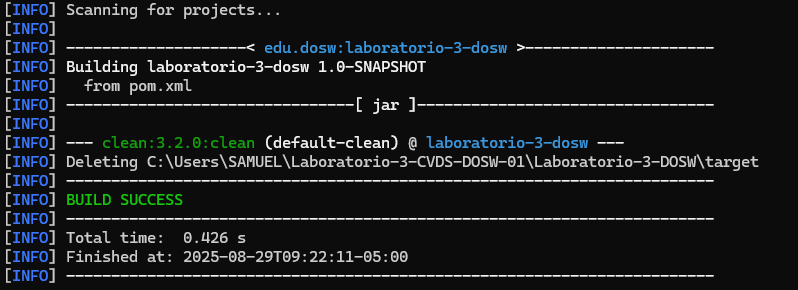
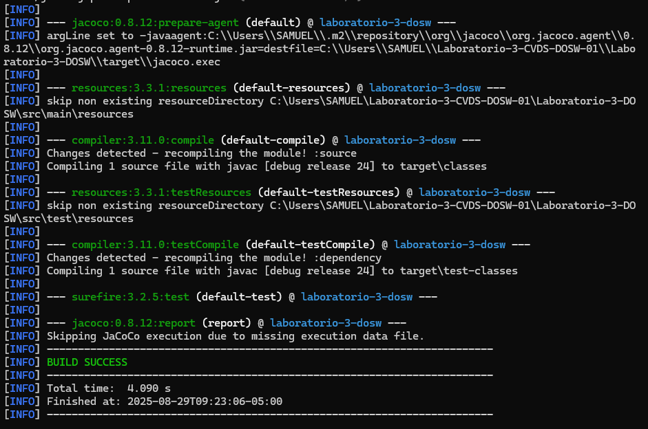
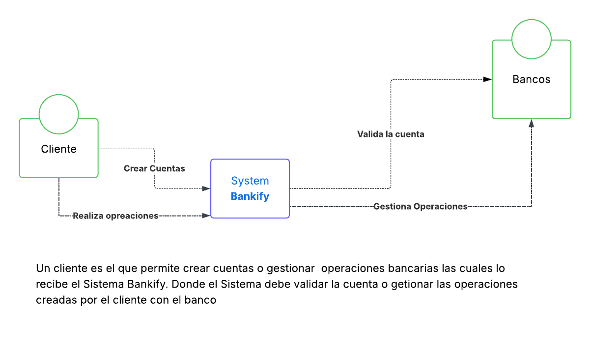
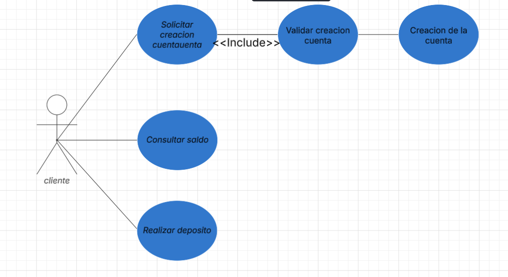
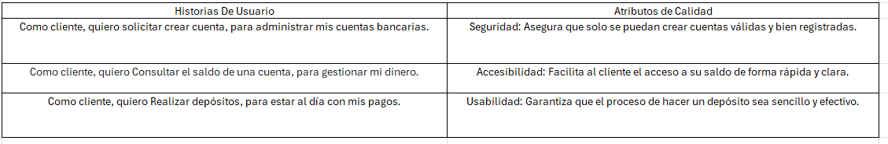
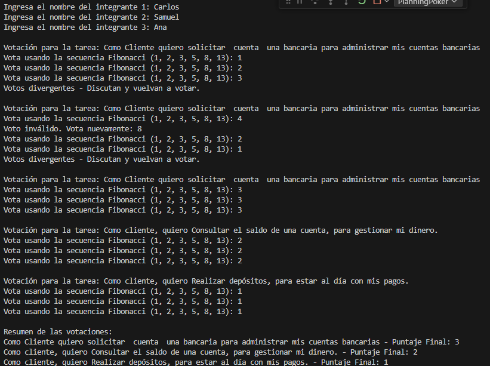
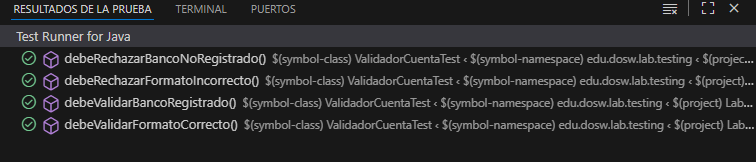
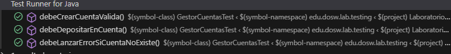

# Laboratorio-3-CVDS-DOSW-01

# Grupo 1 - Equipo 10

# Integrantes:
- Carlos David Astudillo Castiblanco
- Samuel Leonardo Albarracin
- Ana Gabriela Fiquitiva Poveda

# Primera parte lab 3

 Adjuntamos evidencia de que el proyecto esta corriendo bien

# Solución de preguntas
A. ¿Cuál es la diferencia entre una prueba unitaria y una prueba de integración E2E?

Prueba unitaria: Es como probar un pedacito chiquito del código, una función o método, para asegurarte de que hace lo que debe hacer. Es algo súper aislado, no toca nada más fuera de esa pequeña parte.

Prueba E2E (End-to-End): Aquí es donde pruebas todo el sistema de principio a fin, como si fueras un usuario real. Verificas que todas las piezas del sistema trabajen bien juntas, desde la interfaz hasta la base de datos.

B. ¿Para qué sirve la Sprint Retrospective en Scrum?
La Sprint Retrospective es la reunión donde el equipo se reúne al final de cada sprint para hablar de qué salió bien, qué no y cómo mejorar. Es súper importante para la mejora continua, porque da al equipo la oportunidad de reflexionar y ajustar cosas para hacerlo mejor en el siguiente sprint.

C. ¿Qué es una Épica, una Feature y una Historia de Usuario?

Épica: Es como una gran idea o tema que engloba varias cosas más pequeñas. Algo grande que se divide en partes más manejables.

Ejemplo (Netflix): "Mejorar la experiencia de ver contenido en móviles".

Feature: Es una funcionalidad importante del sistema, algo que realmente el usuario va a usar.

Ejemplo: "Recomendaciones personalizadas según lo que hayas visto".

Historia de Usuario: Es una descripción pequeña de lo que el usuario quiere hacer con el sistema. Normalmente sigue un formato como: "Como [usuario], quiero [función] para [beneficio]".

Ejemplo: "Como usuario, quiero pausar un video para verlo más tarde".

D. ¿Qué es la cobertura de código y por qué 100% no garantiza que el software esté libre de errores?
La cobertura de código te dice qué porcentaje de tu código ha sido probado. Aunque tengas un 100% de cobertura, no significa que el software no tenga errores, porque solo estás verificando que el código se ejecute, no que funcione correctamente en todas las situaciones posibles.

E. ¿Qué es un Diagrama de Casos de Uso y qué elementos tiene?

El Diagrama de Casos de Uso es un dibujo que te muestra cómo los usuarios (actores) interactúan con el sistema. Los elementos principales son:

Actores: Son las personas o sistemas que usan el sistema.

Casos de uso: Son las acciones que el sistema permite hacer.

Relaciones: Cómo los actores interactúan con los casos de uso.

Es útil en la fase de análisis porque ayuda a entender qué funcionalidades debe tener el sistema y cómo van a interactuar los usuarios con él.

F. ¿Cuál es la diferencia entre JUnit, JaCoCo y SonarQube?

- JUnit: Es una herramienta para escribir y ejecutar pruebas unitarias, para asegurarte de que el código funciona bien.
- JaCoCo: Mide cuánta parte del código has probado con JUnit, o sea, la cobertura de tu código.
- SonarQube: Hace un análisis más profundo del código, buscando problemas de calidad, errores potenciales y malas prácticas.

G. ¿Por qué usar Planning Poker y qué ventajas tiene?
Planning Poker es una forma de estimar el esfuerzo de las tareas en equipo. Cada miembro del equipo elige en secreto cuánto cree que va a costar una tarea, y luego todos muestran sus estimaciones al mismo tiempo. Algunas ventajas son:
- Mejora la transparencia: Todos los del equipo tienen voz y participan.
- Previene el sesgo: Nadie influye en las estimaciones de los demás.
- Fomenta el compromiso: Al ser colaborativo, todos se sienten parte del proceso y más responsables.

H. ¿Cuáles son los valores de Scrum y cuál es el más difícil de aplicar?

Compromiso:
Todos los miembros del equipo se comprometen a dar lo mejor de sí mismos para alcanzar los objetivos del Sprint y del proyecto. Esto implica ser responsable de las tareas asignadas y trabajar juntos para lograr las metas acordadas.

Coraje:
Se espera que los miembros del equipo tengan el coraje de tomar decisiones difíciles, probar nuevas ideas y enfrentarse a problemas o situaciones incómodas sin evitar el conflicto. El coraje también incluye asumir riesgos cuando sea necesario y tomar decisiones que pueden no ser fáciles.

Foco:
El equipo se concentra en lo que es más importante durante el Sprint, asegurándose de que cada miembro esté alineado con las prioridades y no se distraiga con tareas no esenciales. Esto ayuda a mantener el rumbo y cumplir los objetivos.

Apertura:
Los miembros del equipo son transparentes, comparten sus pensamientos, ideas y problemas, y están dispuestos a escuchar y considerar las opiniones de los demás. La apertura fomenta la colaboración y mejora la comunicación dentro del equipo.

Respeto:
Cada miembro del equipo valora las habilidades, conocimientos y experiencias de los demás. Se fomenta un ambiente donde todos se sienten escuchados y respetados, lo que permite una colaboración efectiva y una mejor resolución de problemas.

El compromiso puede ser difícil porque, a veces, los miembros del equipo pueden no estar completamente motivados o alineados con los objetivos del proyecto. Si no tienen un fuerte sentido de propósito o conexión con el proyecto, puede ser más difícil que se comprometan al 100%. Además, la presión externa o las distracciones pueden afectar el nivel de compromiso de cada miembro.

### Muestra de que maven esta corriendo correctamente

la estructura de carpetas tambien se encuentra tal como dijo el profesor, en src, se encuentran util testing y agilismo, y tenemos una carpeta especifica para pruebas unitarias

# Solución Reto 1
**Identifiquen reglas de negocio.**
- La cuenta debe tener 10 dígitos
- No debe tener Caracteres especiales
- Los primeros dos dígitos deben ser los correspondientes al banco
- Cada cuenta esta asignada a un cliente único
- No se puede realizar un deposito si la cuenta no es valida 
- No se puede consultar saldo si la cuenta no está en el sistema 
**Definan las funcionalidades principales.**
- Crear cuentas bancarias.
- Validar las cuentas.
- Consultar el saldo de una cuenta.
- Realizar Deposito
**Escriban los actores principales.**
- Cliente (quien realiza las operaciones con la cuenta).
- Sistema Bankify El sistema que valida las cuentas y realiza las operaciones bancarias de acuerdo con las reglas de negocio.
- Bancos: como entidad que proporciona los códigos de banco y puede validar que los primeros dos dígitos de una cuenta correspondan a un banco registrado.
**Documenten las precondiciones necesarias para el sistema.**

- El sistema debe verificar que los números de cuenta sigan las reglas antes de permitir la creación.
- Debe haber una lista de bancos registrados para validar las cuentas.
- El cliente debe tener un numero de cuenta valido para realizar operaciones
- La cuenta debe existir para realizar operaciones bancarias
- El saldo de una cuenta nueva se considera como cero 
- El sistema debe estar disponible para realizar operaciones 

**Explicación Diagrama de Contexto**
- Un cliente es el que permite crear cuentas o gestionar  operaciones bancarias las cuales lo recibe el Sistema Bankify. Donde el Sistema debe validar la cuenta o getionar las operaciones creadas por el cliente con el banco 

**Explicación Reto3**
1. Strategy
- Se evidencia en EstrategiaVotacion (interfaz) y en EstrategiaFibonacci (implementación concreta).
- Explicación: Se utiliza el patrón Strategy para definir diferentes maneras de realizar una votación sin cambiar el código principal. En este caso, la votación se basa en la secuencia de Fibonacci, pero podrían añadirse otras estrategias implementando la misma interfaz.

2. Principio de Abierto/Cerrado (Open/Closed - SOLID)
- Se evidencia en EstrategiaVotacion permite agregar nuevas estrategias sin modificar las clases existentes.
- Explicación: El sistema está abierto a la extensión (nuevas estrategias de votación) pero cerrado a la modificación (no hay que cambiar el código ya escrito).

3. Principio de Inversión de Dependencia (DIP - SOLID)
- Se evidencia en que un integrante no depende de una implementación concreta de la votación, sino de la interfaz EstrategiaVotacion.
- Explicación: Esto quita que un integrante dependa de un método específico de votación, permitiendo cambiar la estrategia en tiempo de ejecución.

4. Encapsulamiento (OOP)
- Se evidencia en las Clases Tarea, Integrante, Votacion.
- Explicación: Cada clase oculta sus atributos (private) y los expone mediante métodos get y set, asegurando que los datos no sean manipulados de forma indebida.

5. Responsabilidad Única (SRP - SOLID)
- Se evidencia en las Clases:
- Tarea: administra la información de una tarea.
- Integrante: representa un miembro del equipo y su votación.
- Votacion: gestiona el proceso de votación.
- Explicación: Cada clase tiene una sola responsabilidad clara, lo que mejora la mantenibilidad y legibilidad del código.

6. Principio de Composición sobre Herencia

- Se ve evidenciado en  Integrante  debido a que tiene una EstrategiaVotacion en lugar de heredar de ella.
- Explicación: Esto da mayor flexibilidad al poder cambiar dinámicamente el comportamiento de votación sin modificar la jerarquía de clases.

**Explicación Reto4**
1. Patrón Strategy
- Se evidencia en ValidadorCuenta y sus métodos de validación (validarFormato, validarBanco).
- Explicación: Se encapsulan las reglas de validación en una clase independiente. Esto permite modificar o extender las reglas de validación sin afectar la lógica de gestión de cuentas. En el futuro se pueden agregar más estrategias de validación (por ejemplo, validación internacional) sin alterar el código existente.

2. Principio de Responsabilidad Única (SRP – SOLID)
- Se evidencia en:
- Cuenta gestiona saldo y datos de la cuenta.
- Cliente administra la relación con sus cuentas.
- ValidadorCuenta se encarga exclusivamente de la validación de reglas.
- GestorCuentas coordina las operaciones de negocio (crear, depositar, consultar).

3. Principio de Abierto/Cerrado (OCP – SOLID)
- Se evidencia en  ValidadorCuenta se puede extender con nuevas validaciones sin modificar las existentes.

4. Principio de Inversión de Dependencia (DIP – SOLID)
- Se evidencia en  GestorCuentas depende de la abstracción (ValidadorCuenta) en lugar de depender de reglas de validación escritas directamente en la clase.

5. Composición sobre Herencia
- Se evidencia en:
- Cliente contiene una lista de Cuenta.
- GestorCuentas utiliza una instancia de ValidadorCuenta.

- En lugar de heredar, las clases se componen de objetos que colaboran entre sí. 

6. Uso de Streams y Lambdas (Java 8+)
- Se aplicaron en 
- Cliente.buscarCuenta(...) usa Streams y filter para encontrar cuentas.
- GestorCuentas usa Optional.ifPresentOrElse para manejar la existencia de una cuenta.

7. TDD (Test-Driven Development)
- Se escribieron primero pruebas unitarias (ValidadorCuentaTest, GestorCuentasTest).
- Luego se implementaron las clases hasta que las pruebas pasaran.

